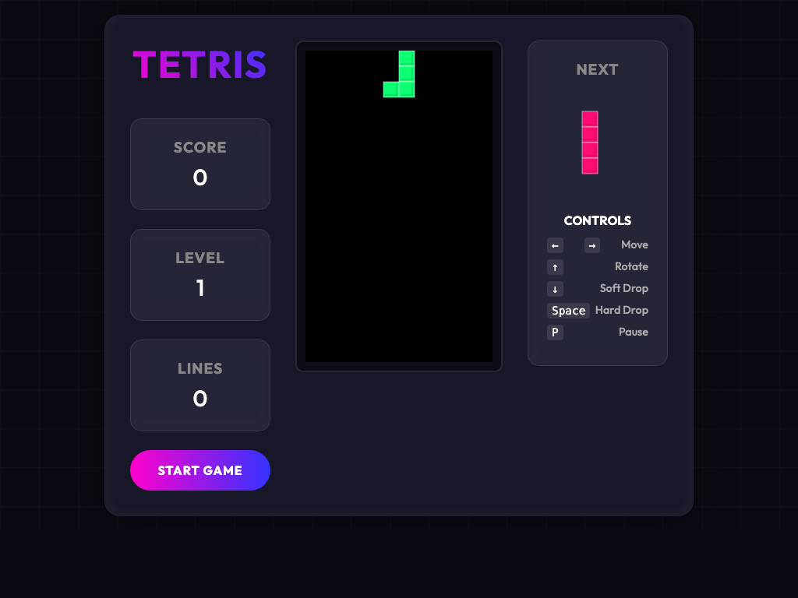

# Tetris

A classic Tetris game implementation using HTML5, CSS3, and JavaScript.

## Description

This project is a web-based version of the famous tile-matching puzzle game, Tetris. It features a clean interface, smooth animations, and classic gameplay mechanics.



## Features

-   Classic Tetris gameplay
-   Score tracking
-   Next piece preview
-   Game over state
-   Responsive design

## How to Play

1.  Clone the repository or download the source code.
2.  Open `index.html` in your web browser.
3.  Click the "Start Game" button to begin.

## Controls

-   **Left Arrow**: Move piece left
-   **Right Arrow**: Move piece right
-   **Down Arrow**: Soft drop (move piece down faster)
-   **Up Arrow**: Rotate piece
-   **Space**: Hard drop (instantly drop piece)
-   **P**: Pause/Resume game

## Technologies Used

-   HTML5
-   CSS3
-   JavaScript

## Development

### Generating Screenshots

To update the gameplay screenshot, use the following command (ensure the path to `index.html` is correct):

```bash
/Applications/Google\ Chrome.app/Contents/MacOS/Google\ Chrome --headless --disable-gpu --window-size=1024,768 --screenshot=gameplay.png "file:///Users/hui/code/tetris/index.html"
```
